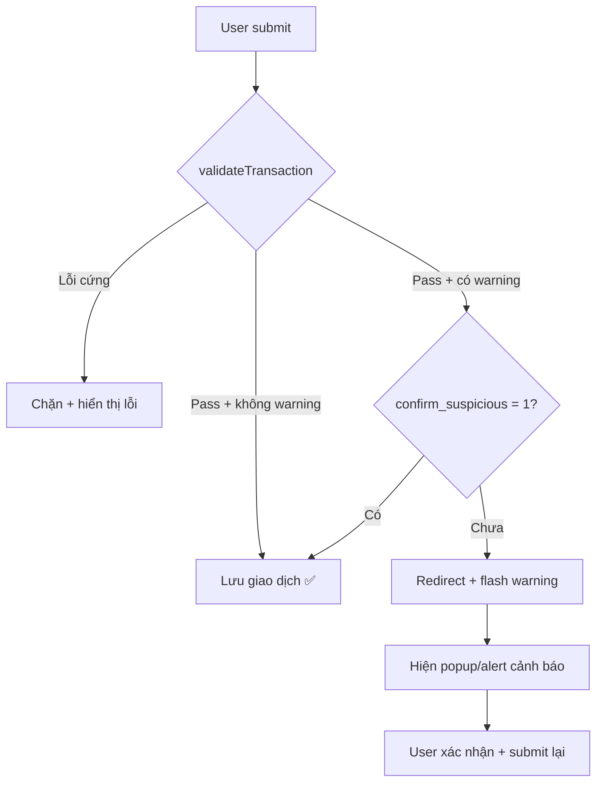

# Centralized Transaction Policy Layer — Kế Hoạch Hoàn Chỉnh (Final)

## Tổng Quan

Gom toàn bộ validation/policy vào 1 file `includes/transaction_policy.php`, buộc mọi luồng tạo/sửa giao dịch (`add`, `quick_add`, `edit`) đi qua cùng logic.

### Quyết Định Đã Xác Nhận

| Hạng mục | Quyết định |
|---|---|
| Giao dịch quá hạn | **Soft-delete** (`is_archived = 1`), không xóa khỏi DB |
| User mới chưa có income | **Phương án C** — cho phép âm tối đa -1.000.000đ |
| Giao dịch đáng ngờ | **Popup confirm** cho cả Add, Quick Add, Edit |
| Ngưỡng hằng số | Tất cả giữ nguyên như đề xuất (xem bảng dưới) |

### Hằng Số Cấu Hình

```php
const MAX_TRANSACTIONS_PER_USER  = 500;
const MAX_TRANSACTIONS_PER_DAY   = 20;
const TRANSACTION_RETENTION_DAYS = 365;
const SUSPICIOUS_BALANCE_RATIO   = 0.5;    // > 50% số dư
const DUPLICATE_WINDOW_MINUTES   = 5;
const RATE_LIMIT_SECONDS         = 10;
const NEGATIVE_BALANCE_LIMIT     = -1000000; // Phương án C
```

---

## 6 Policies Chi Tiết

### Policy 1: Giới hạn số giao dịch

- `MAX_TRANSACTIONS_PER_USER = 500` — tổng giao dịch active
- `MAX_TRANSACTIONS_PER_DAY = 20` — chống tạo quá nhiều/ngày
- Chỉ áp dụng khi **tạo mới** (không áp dụng khi sửa)
- Chặn cứng + thông báo rõ ràng

### Policy 2: Soft-delete giao dịch quá hạn

- Thêm cột `is_archived TINYINT(1) DEFAULT 0` vào bảng `transaction`
- Giao dịch có `transaction_date` quá 365 ngày → `is_archived = 1`
- Chạy cleanup khi user truy cập dashboard
- Tất cả query thêm `WHERE is_archived = 0`
- Dữ liệu vẫn tồn tại trong DB, có thể khôi phục

### Policy 3: Chặn khi số dư không đủ (Phương án C)

**Công thức**: `balance = SUM(income, active) - SUM(expense, active)`

Chỉ áp dụng cho expense. Cho phép balance âm tối đa -1.000.000đ.

**6 Edge Cases:**

| # | Tình huống | Xử lý |
|---|---|---|
| EC1 | Thêm expense khi balance < price nhưng balance_after >= -1tr | **Cho phép** |
| EC2 | Thêm expense khi balance_after < -1tr | **Chặn** + thông báo |
| EC3 | Sửa expense tăng giá: balance khả dụng = balance + oldPrice | Tính lại rồi kiểm tra |
| EC4 | Sửa income → expense: balance khả dụng = balance - oldPrice | Tính lại rồi kiểm tra |
| EC5 | Sửa expense → income | **Luôn OK** |
| EC6 | Expense = đúng bằng balance (balance_after = 0) | **Cho phép** |

**Công thức khi sửa:**
```
balance = getCurrentBalance(userId, excludeId = editingId)
// → tự động loại trừ giao dịch đang sửa khỏi tính toán
Nếu type mới = expense → kiểm tra: balance - newPrice >= NEGATIVE_BALANCE_LIMIT
Nếu type mới = income → luôn cho phép
```

### Policy 4: Popup xác nhận giao dịch đáng ngờ

**3 tiêu chí:**

| Tiêu chí | Ngưỡng |
|---|---|
| Số tiền lớn | > 50% số dư hiện tại (chỉ expense) |
| Trùng lặp | Cùng amount + category + type trong 5 phút |
| Ngoài giờ | 00:00 – 05:00 |

**Luồng xử lý thống nhất (add / quick_add / edit):**



- **Add/Edit**: Redirect về form, hiện alert box + checkbox xác nhận
- **Quick Add**: Redirect về dashboard, hiện modal overlay + nút xác nhận/hủy

### Policy 5: Gom validation cơ bản

Tạo hàm `validateBasicFields($data)` thay thế validation duplicate:

| Rule | add.php hiện tại | edit.php | quick_add.php | Sau khi gom |
|---|---|---|---|---|
| price > 0, float | ✅ | ✅ | ⚠️ | `validateBasicFields()` |
| category_id format | ✅ | ✅ | ❌ | `validateBasicFields()` |
| category tồn tại DB | ❌ | ❌ | ❌ | `validateBasicFields()` ← **MỚI** |
| date format Y-m-d | ✅ | ✅ | ❌ | `validateBasicFields()` |
| type = income/expense | ❌ | ❌ | ❌ | `validateBasicFields()` ← **MỚI** |
| description ≤ 100 chars | ❌ | ❌ | ❌ | `validateBasicFields()` ← **MỚI** |

### Policy 6: Rate Limiting

- Tối thiểu 10 giây giữa 2 lần **tạo** giao dịch
- Chỉ áp dụng khi tạo mới (add/quick_add), không áp dụng khi sửa
- Kết hợp với MAX_PER_DAY để chặn cả burst lẫn tổng

---

## Proposed Changes

### Database

#### [MODIFY] [quan_ly_chi_tieu.sql](file:///c:/xampp/htdocs/QUAN_LY_CHI_TIEU/database/quan_ly_chi_tieu.sql)

```sql
ALTER TABLE `transaction` 
ADD COLUMN `is_archived` TINYINT(1) NOT NULL DEFAULT 0 
COMMENT 'Trạng thái lưu trữ (0=active, 1=archived)' 
AFTER `update_at`;
```

> [!NOTE]
> Không thêm cột `budget` vào `user`. Số dư tiếp tục tính dynamic để tránh desync.

---

### Core

#### [NEW] [transaction_policy.php](file:///c:/xampp/htdocs/QUAN_LY_CHI_TIEU/includes/transaction_policy.php)

File trung tâm chứa toàn bộ policy. Các hàm chính:

| Hàm | Mục đích |
|---|---|
| `validateTransaction($userId, $data, $editingId)` | Orchestrator — gọi tất cả policy |
| `validateBasicFields($data)` | Policy 5 — validation cơ bản |
| `checkTransactionLimits($userId)` | Policy 1 — giới hạn số lượng |
| `archiveExpiredTransactions($userId)` | Policy 2 — soft-delete quá hạn |
| `getCurrentBalance($userId, $excludeId)` | Policy 3 — tính balance |
| `checkBalanceSufficient($userId, $price, $editingId)` | Policy 3 — kiểm tra đủ balance |
| `checkSuspicious($userId, $price, $type, $catId, $editingId)` | Policy 4 — phát hiện đáng ngờ |
| `checkRateLimit($userId)` | Policy 6 — rate limiting |

#### [MODIFY] [index.php](file:///c:/xampp/htdocs/QUAN_LY_CHI_TIEU/index.php)

- Thêm `require_once "includes/transaction_policy.php";` sau dòng `require_once "includes/database.php";`

---

### Modules

#### [MODIFY] [add.php](file:///c:/xampp/htdocs/QUAN_LY_CHI_TIEU/modules/user/add.php)

- Xóa validation rời rạc (dòng 18–36)
- Chuẩn bị `$data` với key mapping (`category` → `category_id`)
- Gọi `$result = validateTransaction($id, $data);`
- Nếu `errors` → flash errors + redirect
- Nếu `warnings` + chưa có `$_POST['confirm_suspicious']` → flash warning data + redirect
- Nếu OK hoặc đã confirm → insert

#### [MODIFY] [quick_add.php](file:///c:/xampp/htdocs/QUAN_LY_CHI_TIEU/modules/user/quick_add.php)

- Sau NLP parse xong (trước INSERT ở dòng 140), gọi `validateTransaction($id, $dataInsert);`
- Nếu `errors` → flash message rõ ràng + redirect dashboard
- Nếu `warnings` + chưa confirm → flash `suspicious_data` + `suspicious_reasons` + redirect dashboard
- Nếu `$_POST['confirm_suspicious']` → bypass warning check, insert trực tiếp

#### [MODIFY] [edit.php](file:///c:/xampp/htdocs/QUAN_LY_CHI_TIEU/modules/user/edit.php)

- Xóa validation duplicate (dòng 20–32)
- Gọi `$result = validateTransaction($userId, $data, $id);` — truyền `$id` cho balance chính xác
- Xử lý warnings tương tự add.php

---

### Cập Nhật Queries — Thêm `is_archived = 0`

#### [MODIFY] [functions.php](file:///c:/xampp/htdocs/QUAN_LY_CHI_TIEU/includes/functions.php)

- `getTotalSum()`: thêm `AND is_archived = 0`

#### [MODIFY] [dashboard.php (template)](file:///c:/xampp/htdocs/QUAN_LY_CHI_TIEU/templates/user/dashboard.php)

- Gọi `archiveExpiredTransactions($user['id'])` ở đầu trang (trước query)
- Query `countRows` + `getAll` transactionList: thêm `AND is_archived = 0`
- Thêm modal overlay cho xác nhận quick_add đáng ngờ

#### [MODIFY] [filter.php (module)](file:///c:/xampp/htdocs/QUAN_LY_CHI_TIEU/modules/user/filter.php)

- `$where` mặc định: thêm `AND is_archived = 0`

#### [MODIFY] [filter.php (template)](file:///c:/xampp/htdocs/QUAN_LY_CHI_TIEU/templates/user/filter.php)

- Query mặc định khi chưa filter: thêm `AND is_archived = 0`

#### [MODIFY] [export.php](file:///c:/xampp/htdocs/QUAN_LY_CHI_TIEU/modules/user/export.php)

- Query export CSV: thêm `AND is_archived = 0`

---

### Templates — UI Cảnh Báo

#### [MODIFY] [add.php (template)](file:///c:/xampp/htdocs/QUAN_LY_CHI_TIEU/templates/user/add.php)

- Đọc flash `suspicious_warning` + `suspicious_form_data`
- Nếu có → hiển thị alert box cảnh báo với lý do chi tiết
- Thêm checkbox "Tôi xác nhận giao dịch này hợp lệ"
- Thêm hidden input `confirm_suspicious=1`
- Auto-fill lại form data từ flash

#### [MODIFY] [edit.php (template)](file:///c:/xampp/htdocs/QUAN_LY_CHI_TIEU/templates/user/edit.php)

- Tương tự add.php template: alert box + checkbox xác nhận

#### [MODIFY] [dashboard.php (template)](file:///c:/xampp/htdocs/QUAN_LY_CHI_TIEU/templates/user/dashboard.php)

- Thêm modal overlay cho quick_add đáng ngờ:
  - Đọc flash `suspicious_data` + `suspicious_reasons`
  - Hiện modal với lý do cảnh báo + thông tin giao dịch đã parse
  - Nút "Xác nhận" → submit form ẩn với dữ liệu + `confirm_suspicious=1`
  - Nút "Hủy" → đóng modal

---

### Cập Nhật SQL Schema File

#### [MODIFY] [quan_ly_chi_tieu.sql](file:///c:/xampp/htdocs/QUAN_LY_CHI_TIEU/database/quan_ly_chi_tieu.sql)

- Thêm cột `is_archived` vào CREATE TABLE `transaction` trong file dump

---

## Tổng Hợp Files Thay Đổi

| File | Loại | Thay đổi chính |
|---|---|---|
| `includes/transaction_policy.php` | **NEW** | Toàn bộ 6 policies |
| `database/quan_ly_chi_tieu.sql` | MODIFY | Thêm cột `is_archived` |
| `index.php` | MODIFY | Thêm require |
| `includes/functions.php` | MODIFY | `getTotalSum` + `is_archived = 0` |
| `modules/user/add.php` | MODIFY | Dùng `validateTransaction()` |
| `modules/user/quick_add.php` | MODIFY | Dùng `validateTransaction()` |
| `modules/user/edit.php` | MODIFY | Dùng `validateTransaction()` |
| `modules/user/filter.php` | MODIFY | Query thêm `is_archived = 0` |
| `modules/user/export.php` | MODIFY | Query thêm `is_archived = 0` |
| `templates/user/dashboard.php` | MODIFY | Archive + modal + query fix |
| `templates/user/add.php` | MODIFY | Alert box + checkbox confirm |
| `templates/user/edit.php` | MODIFY | Alert box + checkbox confirm |
| `templates/user/filter.php` | MODIFY | Query thêm `is_archived = 0` |

**Tổng: 1 file mới + 12 file sửa**

---

## Verification Plan

### Automated Tests
- Test script PHP kiểm tra từng policy riêng lẻ
- Test 6 edge cases của balance check
- Test rate limit: 2 giao dịch liên tiếp < 10s

### Manual Browser Tests
1. Add expense khi balance đủ → ✅ thành công
2. Add expense khi balance_after < -1tr → ❌ chặn + thông báo
3. Add expense > 50% balance → ⚠️ popup confirm
4. Quick Add đáng ngờ → modal confirm trên dashboard
5. Edit expense tăng giá vượt balance → ❌ chặn
6. Tạo 2 giao dịch < 10s → ❌ rate limit
7. Dashboard hiển thị đúng (chỉ active transactions)
8. Filter/Export không bao gồm archived
